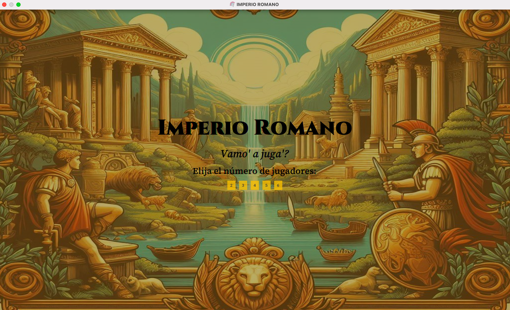
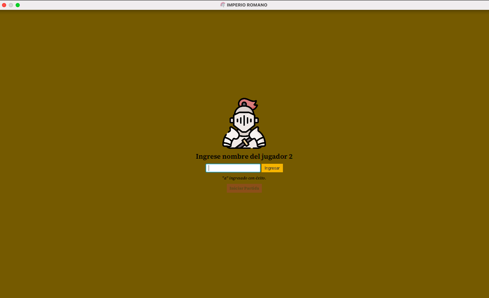
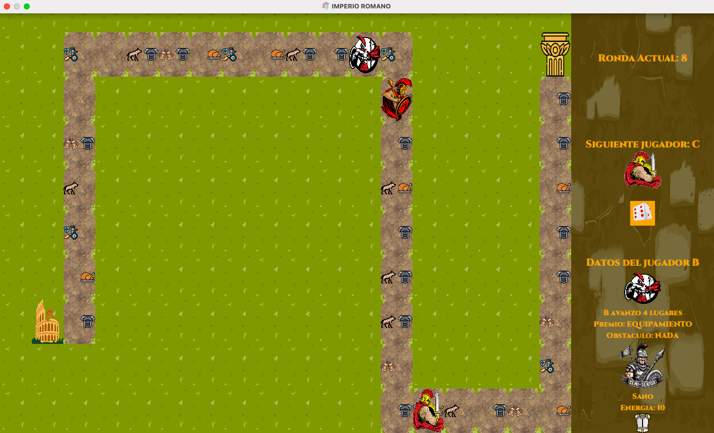

[](https://codecov.io/gh/fnpratto/algo3_tp2)

# TP2 Algoritmos 3 - IMPERIO ROMANO -

Trabajo Práctico número 2 de la materia Algoritmos y Programación III de FIUBA
## Grupo {N2}

- **Integrante 1** - [Florencia Pratto](https://github.com/fnpratto)
- **Integrante 2** - [Sebastián Kraglievich](https://github.com/Sebakrag)
- **Integrante 3** - [Agustina Germinario](https://github.com/agus-germi)
- **Integrante 4** - [Maria Galindez](https://github.com/mariagalindez)
- **Integrante 5** - [Sair Barreto Sosa](https://github.com/SairBarreto)

Corrector: [**Alejo Villores**](https://github.com/alejovillores)

## Especificaciones

La versión más reciente de la aplicación puede encontrarse en la pestaña [releases](https://github.com/fiuba/algo3_proyecto_base_tp2/releases/latest) y ejecutarse en Linux, Windows o Mac de esta forma:

```bash
$ java -jar <archivo.jar>
```

## Sobre la aplicación

La aplicación consiste en un juego de tablero por turnos. El mismo se puede jugar desde 2 a 6 jugadores. Cada jugador tiene un gladiador asignado y un nombre a elección.
El objetivo del juego es llegar desde el *Coliseo Romano* hasta *Pompeya* atravesando distintos obstáculos y desafíos. El primero en **_llegar a Pompeya con la llave_** gana el juego.






## Desarrollo

Aquellos que deseen colaborar con el proyecto pueden consultar la [guía de desarrollo](./docs/Desarrollo.md).

## Licencia

Este repositorio se encuentra bajo la Licencia MIT.
